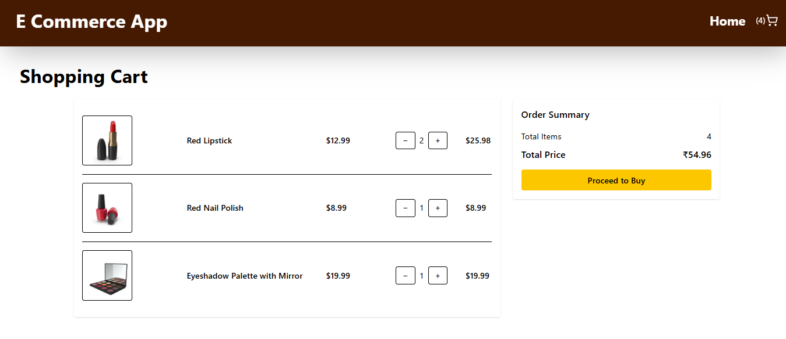

# React + TypeScript + Vite
1️⃣ Project Title & Description
# Product Search App

A React application that fetches products from DummyJSON API,
allows searching, pagination, and name, category, price filtering.
________________________________________
2️⃣ Features
## Features
- Fetch products from DummyJSON API
- Search products by name, category, price
- Pagination
- Responsive UI
________________________________________
3️⃣ Tech Stack
## Tech Stack
- React
- Axios
- React router
- Context API
- Tailwind CSS
________________________________________
4️⃣ How to Run the Project
## Installation

- download the folder
- npm install
- npm run dev


---

### 5️⃣ API Used
```md
## API
https://dummyjson.com/products
________________________________________
6️⃣ Screenshots 


________________________________________
7️⃣ Live Demo 


